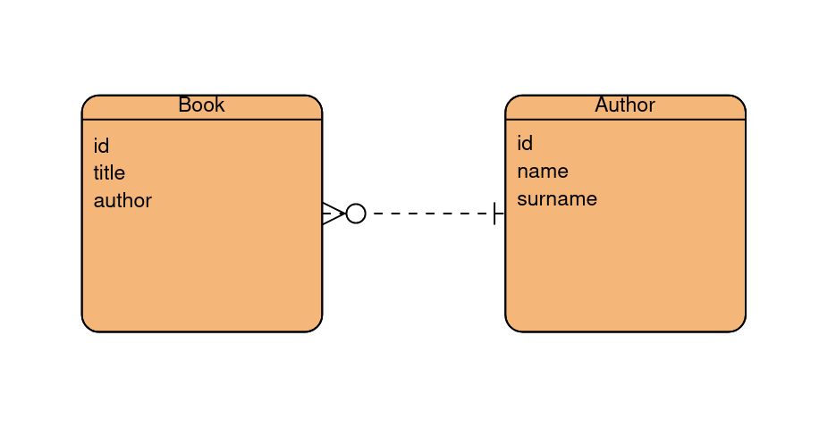

# Úkol 7 - SOAP webová služba

[](https://www.fai.utb.cz/)
[](https://www.java.com/)
[](https://gradle.org/)

|                                  |                                |
| -------------------------------- | ------------------------------ |
| __Maximální počet bodů__         | 12 bodů                        |
| __Způsob komunikace s aplikací__ | Parametry předané při spuštění |
| __Způsob testování aplikace__    | Na základě HTTP komunikace     |

---

## 📝 Zadání úkolu 

Implementujte SOAP webovou službu pro správu knih a jejich autorů v systému. Webová služba by měla umožňovat základní práci s knihami a autory. To zahrnuje vytvoření, aktualizaci, mazání a také získávání informací. Aplikace bude data ukládat do relační databáze MySQL. Tato aplikace bude spuštěna na portu **8080** a bude využívat http připojení.

### Požadavky:
* Implementujte SOAP webovou službu v jazyce Java.
* Pro tvorbu SOAP webových služeb využijte framework Spring boot.
* Pro ukládání knih a autorů v systému použijte technologii JDBC a relační databázi MySQL. Můžete využít například následující službu, která poskytuje free hosting MySQL databáze: https://aiven.io/ 
* Implementujte zpracování pro všechny níže zmíněné SOAP requesty. Všechny požadavky budou zasílány na tento endpoint `http://localhost:8080/ws`.
* U požadavků, které do databáze vkládají data, musí být jejich parametry validované. V případě jména/příjmení je nutné zajistit, aby se skládalo pouze z jednoho slova. U všech string parametru zároveň platí, že musí vždy obsahovat nějakou hodnotu.
* SOAP requesty a respons definujte v xml souboru `library.xsd`, který se nachází ve složce `src/main/resources`.

### Seznam SOAP požadavků pro tuto aplikaci

| Název požadavku       | Popis                        | Atributy         | Typy atributů  |
| --------------------- | ---------------------------- | ---------------- | -------------- |
| `getBookRequest`      | Získání informací o knize    | `bookId`         | `long`         |
| `createBookRequest`   | Vytvoření nové knihy         | `book`           | `Book`         |
| `updateBookRequest`   | Aktualizace existující knihy | `bookId`, `book` | `long`, `Book` |
| `deleteBookRequest`   | Smazání knihy                | `bookId`         | `long`         |
| `getAuthorRequest`    | Získání informací o autorovi | `authorId`       | `long`         |
| `createAuthorRequest` | Vytvoření nového autora      | `author`         | `Author`       |
| `deleteAuthorRequest` | Smazání autora               | `authorId`       | `long`         |

### Seznam SOAP odpovědí pro tuto aplikaci

| Název odpovědi         | Popis                                       | Atributy  | Typy atributů |
| ---------------------- | ------------------------------------------- | --------- | ------------- |
| `getBookResponse`      | Odpověď s informacemi o knize               | `book`    | `Book`        |
| `createBookResponse`   | Odpověď s informacemi o vytvořené knize     | `book`    | `Book`        |
| `updateBookResponse`   | Odpověď s informacemi o aktualizované knize | `book`    | `Book`        |
| `deleteBookResponse`   | Potvrzení smazání knihy                     | `message` | `string`      |
| `getAuthorResponse`    | Odpověď s informacemi o autorovi            | `author`  | `Author`      |
| `createAuthorResponse` | Odpověď s informacemi o vytvořeném autorovi | `author`  | `Author`      |
| `deleteAuthorResponse` | Potvrzení smazání autora                    | `message` | `string`      |


### Datová struktura knihy a autora:

Do relační databáze budou ukládány dvě datové struktury, jejichž struktura a názvy atributů jsou následující. Jedna ze struktur bude pro autora knihy. Autor bude na knize nezávislý. Každá kniha bude mít svůj název a také autora, který už bude v databázi mít záznam. Jeden autor může mít více knih a kniha nemůže být bez autora. __Při odstranění autora z databáze budou také odstraněny i jeho knihy.__



```java
public class Author {

    private Long id;

    private String name;
    
    private String surname;

    // TODO: Getters and setters
}
```

```java
public class Book {

    private Long id;

    private String title;

    private Author author;

    // TODO: Getters and setters
}
```

### Návod na otestování SOAP webové služby

Pro vyzkoušení této aplikace můžete využít nástroj cURL. Pro ukázku zde je požadavek na vytvoření nového autora knihy. Ostatní požadavky se provádějí stejným způsobem.

`curl --header "content-type: text/xml" -d @request_create_author.xml http://localhost:8080/ws`

Zde je obsah souboru `request_create_author.xml`, který posíláme na server pomocí curl příkazu. Server tento požadavek zpracuje a následně odpoví taky formou xml.

```xml
<soapenv:Envelope xmlns:soapenv="http://schemas.xmlsoap.org/soap/envelope/"
   xmlns:lib="http://example.com/book-web-service">
   <soapenv:Header />
   <soapenv:Body>
      <lib:createAuthorRequest>
         <lib:author>
            <lib:id>1</lib:id>
            <lib:name>Your name</lib:name>
            <lib:surname>Your surname</lib:surname>
         </lib:author>
      </lib:createAuthorRequest>
   </soapenv:Body>
</soapenv:Envelope>
```

>_**Poznámka:** Implementace a struktura kódu aplikace je libovolná a je zcela na vás, jak tento problém vyřešíte. Je však důležité, aby aplikace splňovala zadané požadavky._

---

## 🏆 Způsob hodnocení

Vaše implementace bude hodnocena na základě chování aplikace při testování různých scénářů. Automatizovaný testovací nástroj bude předávat vaší aplikaci různé parametry, včetně platných a neplatných, aby otestoval její chování za různých podmínek. V případě testování síťové komunikace mezi více klienty, testovací nástroj bude vytvářet virtuální klienty/servery za účelem ověření funkcionality.

Výsledné hodnocení bude záviset na celkovém počtu úspěšných testovacích případů. Počet bodů získaných z úlohy bude tedy záviset na celkové úspěšnosti při testování. Váš výsledný počet bodů bude určen následujícím vzorcem.

__VP__ = __MB__ * (__UT__ / __CPT__)

### Popis symbolů:

* __VP:__ Výsledný počet bodů.
* __MB:__ Maximální počet bodů pro danou úlohu.
* __UT:__ Počet úspěšných testovacích případů.
* __CPT:__ Celkový počet testovacích případů.

## ⚙️ Jak spustit automatizované hodnocení lokálně na svém počítači?

Automatizované hodnocení můžete spustit lokálně za účelem ověření funkčnosti vaší aplikace. K tomu slouží předpřipravený skript, který je dostupný v repozitáři tohoto úkolu. Výsledný report testování se bude nacházet v souboru ```test_report.html```.

###  Pro uživatele systému Linux:
Spusťte skript s názvem ```run_local_test.sh```.

### Pro uživatele systému Windows:
Spusťte skript s názvem ```run_local_test.bat```.


